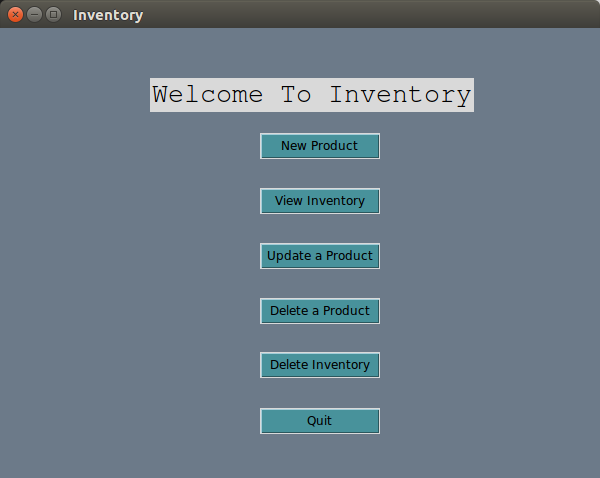
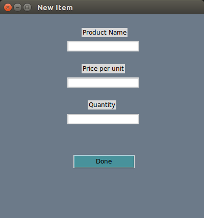

# Inventory

Product Inventory Project - manages an inventory of products. 
 - Adding products
 - Editing product's price and quantity
 - Viewing inventory of existing products
 - Deleting products
 - Clearing the whole inventory store

## Getting Started

* fork this repo
* clone the repo:
    `git clone git@github.com:crestrepo12/inventory.git`

* navigate to inventory folder and install tkinter on linux/ubuntu
    `cd inventory && sudo apt-get install python python3-tk`

### Figures

##### fig 1. The Landing Page.

##### fig 2. Adding a new item to inventory.

### Built With
* ptyhon3
* tkinter 

## Credits
* [Carolina](https://github.com/crestrepo12)
* [Renaldo](https://github.com/renisalcedo)

### License

This project is licensed under the MIT License.
Permission is hereby granted, free of charge, to any person obtaining a copy of this software and 
associated documentation files (the "Software"), to deal in the Software without restriction, 
including without limitation the rights to use, copy, modify, merge, publish, distribute, 
sublicense, and/or sell copies of the Software, and to permit persons to whom the Software is furnished to do so, 
subject to the following conditions:

The above copyright notice and this permission notice shall be included in all copies 
or substantial portions of the Software.

THE SOFTWARE IS PROVIDED "AS IS", WITHOUT WARRANTY OF ANY KIND, EXPRESS OR IMPLIED, 
INCLUDING BUT NOT LIMITED TO THE WARRANTIES OF MERCHANTABILITY, FITNESS FOR A PARTICULAR PURPOSE AND NONINFRINGEMENT. 
IN NO EVENT SHALL THE AUTHORS OR COPYRIGHT HOLDERS BE LIABLE FOR ANY CLAIM, DAMAGES OR OTHER LIABILITY, 
WHETHER IN AN ACTION OF CONTRACT, TORT OR OTHERWISE, ARISING FROM, OUT OF OR IN CONNECTION WITH THE SOFTWARE 
OR THE USE OR OTHER DEALINGS IN THE SOFTWARE.
